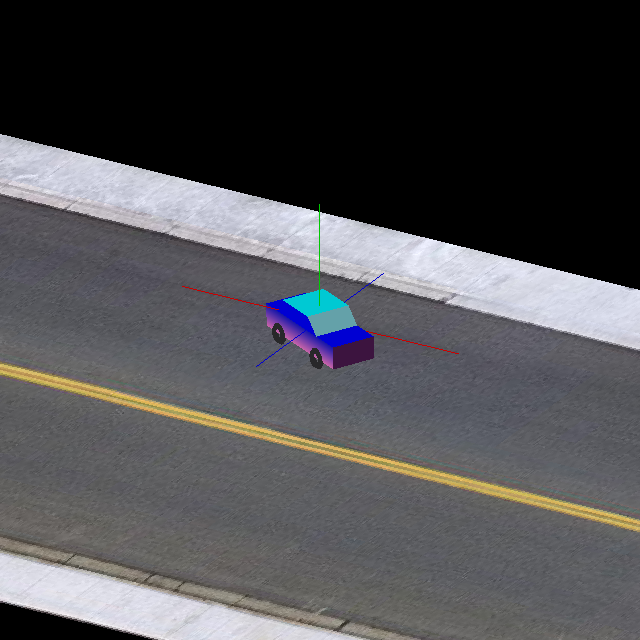

# IMU_car_simulation

This is self designed tools for personal usage.

**Please run the following before using any codes:**

`pip install -r requirements.txt`

## Notes  
The `sencyber` folder includes simple tools for easy coding.

The `application` folder includes all the following applications.

Please check the related `__README.txt` in each folder for detailed information.

## 0x00 application/car_simulation

IMU car simulation application   
Useful links for this project:  
+ [`Kalman Filter`](https://www.bzarg.com/p/how-a-kalman-filter-works-in-pictures/)
+ [`Mahony Filter AHRS`](https://github.com/xioTechnologies/Open-Source-AHRS-With-x-IMU)  
+ [`"Learn OpenGL"`](https://learnopengl.com/)
+ [`"Learn OpenGL" CHN Translation`](https://learnopengl-cn.github.io/)

### MIT License
[**Copyright (c) 2021 Aeir_Elf**](https://github.com/Ag-elf/IMU_car_simulation/blob/main/LICENSE)
